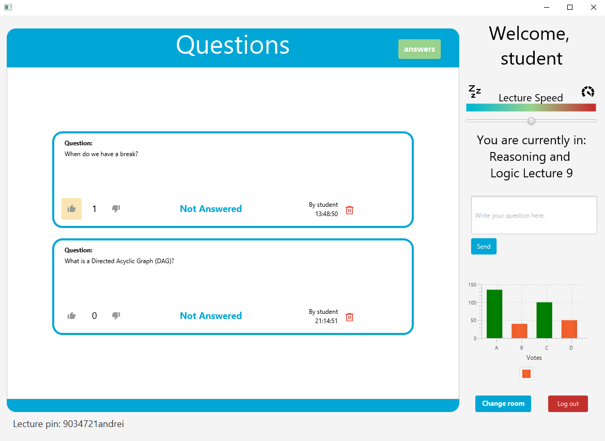

![Contributors][contributors-shield]
![Server Coverage][server-coverage-shield]
![Client Coverage][client-coverage-shield]


<!-- PROJECT LOGO -->
<br />
<p align="center">
    
</p>
<br />

<!-- TABLE OF CONTENTS -->
<details open="open">
  <summary>Table of Contents</summary>
  <ol>
    <li>
      <a href="#about-the-project">About The Project</a>
      <ul>
        <li><a href="#key-features">Key Features</a></li>
        <li><a href="#built-with">Built With</a></li>
      </ul>
    </li>
    <li>
      <a href="#getting-started">Getting Started</a>
      <ul>
        <li><a href="#prerequisites">Prerequisites</a></li>
        <li><a href="#installation-and-how-to-run-it">Installation and how to run it</a></li>
      </ul>
    </li>
    <li><a href="#how-to-contribute-to-it">How to contribute to it</a></li>
    <li><a href="#group-members">Group members</a></li>
  </ol>
</details>

## About The Project

<p align="center">
    
</p>

This application was built for the Object Oriented Programming Project at the Technical University of Delft. It's main purpose is to provide a more interactive way to participate in the lecture in an online setting,
which has become the standard during the corona epidemic.
Students can ask questions to their lecturer which other students can upvote, creating a ranked display of questions so that the lecturer has a clear overview of what students think is most relevant.

### Key features

* Students can ask questions to their Lecturers in a lecture-room which they can join through a pin.
* Students can indicate their opinion on the lecture pace.
* Students can upvote/downvote questions and delete their own questions.
* Questions can be deleted/modified by lecturers and moderators.
* Lecturers can provide a written answer or mark the questions as answered verbally.
* Lecturers can get input from their students by creating polls.
* Lecturers can schedule lecture-rooms to start in the future.
* Lecturers can look at archived lecture-rooms which they can also export to a file.
* Users can be appointed the role of moderator which gives them lecturer privileges.
* The admin can limit the rate of questions a student can ask.
* All user actions to the server are logged for the admin to see.
* Students can be banned.

### Built With

* [Spring](https://spring.io/projects/spring-framework)
* [JavaFX](https://openjfx.io)
* [Jersey](https://eclipse-ee4j.github.io/jersey/)


<!-- GETTING STARTED -->
## Getting Started

To get a local copy up and running follow these simple example steps.

### Prerequisites

Since the project was developed with Java a recent version of Java is required.

### Installation and how to run it

Clone the repo
   ```sh
   git clone https://gitlab.ewi.tudelft.nl/cse1105/2020-2021/team-repositories/oopp-group-32/repository-template.git
   ```

Open the project with your preferred IDE, a good choice will be IntelliJ. 

First run the server by navigating to the correct folder: 

`server -> src -> main -> java -> nl.tudelft.oopp.demo -> DemoApplication.java`

Run the main method in DemoApplication.

After that run the client by navigating to the following folder:

`client -> src -> main -> java -> nl.tudelft.oopp.demo -> MainApp.java`

Run the main method in MainApp.

<!-- CONTRIBUTING -->
## How to contribute to it

Contributions are welcomed and appreciated. In order to contribute follow these steps:

1. Clone the project
2. Create your feature branch (`git checkout -b feature`)
3. Commit your changes (`git commit -m 'Add some feature'`)
4. Push to the branch (`git push origin feature`)
5. Open a merge request

## Group members

| 📸 | Name | Email |
|---|---|---|
|  | Rodrigo Álvarez Lucendo | R.AlvarezLucendo@student.tudelft.nl |
|  | Sérénic Monté | S.G.M.Monte@student.tudelft.nl |
|  | Miloš Ristić | m.ristic-1@student.tudelft.nl |
|  | Jos Sloof | a.j.g.sloof@student.tudelft.nl |
|  | Efe Sozen | E.Sozen@student.tudelft.nl |
|  | Marc Neeleman | m.r.w.neeleman@student.tudelft.nl |


<!-- MARKDOWN LINKS & IMAGES -->
[contributors-shield]: https://img.shields.io/badge/Contributors-6-green
[server-coverage-shield]: https://img.shields.io/badge/Server%20Coverage-96-00A6D6
[client-coverage-shield]: https://img.shields.io/badge/Client%20Coverage-24-00A6D6